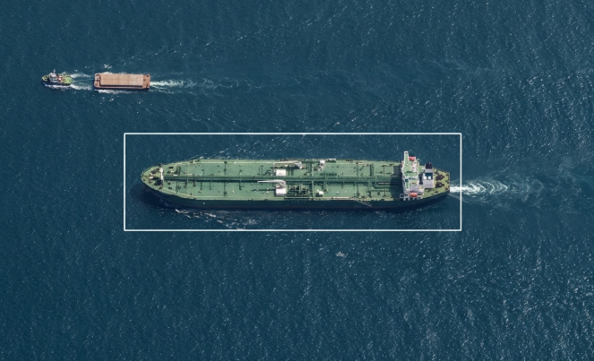
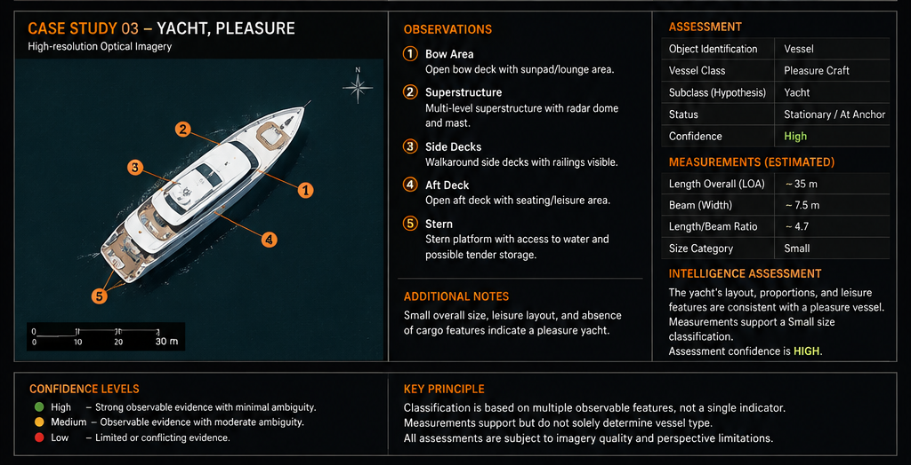

# SATELLITE VESSEL INTELLIGENCE

**Detect · Observe · Measure · Classify · Assess**

Transforming overhead imagery into structured vessel intelligence through visual analysis, spatial measurement and evidence-based classification.

---

## Intelligence Question

### What can observable vessel characteristics reveal from overhead imagery?

Overhead imagery can provide evidence of a vessel's presence, geometry, dimensions, deck configuration and structural characteristics.

The objective is not simply to identify an object as a vessel.

The objective is to determine **what can be reliably observed, what those observations may indicate, and what classification can be supported by the available evidence.**

---

## 01 — Observation

The analysis begins with the imagery itself.

The first question is:

> **What is directly visible?**

Observable characteristics may include:

- Overall vessel geometry
- Hull shape and proportions
- Bow and stern configuration
- Deck layout
- Cargo arrangement
- Superstructure and bridge position
- Cranes, piping or other visible infrastructure
- Relationship to surrounding maritime infrastructure

The detected object is first assessed as:

**Vessel · Barge · Platform · Buoy · Other · Unresolved**

> **Analytical principle:** A classification is not assigned before the observable object has first been identified.

---

## 02 — Identification

Once an object is assessed as a vessel, the analysis considers its observable physical and structural characteristics.

The objective is to establish the broad vessel category before moving toward a more specific classification.

### Broad Class

Examples may include:

- Cargo
- Tanker
- Passenger
- Pleasure
- Fishing
- Offshore
- Other

### Subclass

Where sufficient evidence is available, the assessment may be refined to a more specific vessel type.

Examples may include:

- General Cargo
- Bulk Carrier
- Container Vessel
- Crude Oil Tanker
- Product Tanker
- LPG / LNG Carrier
- Ferry
- Yacht

> **Classification is based on converging characteristics rather than a single visual feature.**

---

## 03 — Measurement

Vessel geometry provides additional evidence for classification.

The primary measurements assessed are:

| Measurement | Analytical Use |
|---|---|
| **Length Overall (LOA)** | Approximate vessel length from the forward-most to aft-most visible extent |
| **Beam** | Approximate maximum vessel breadth |
| **L/B Ratio** | Additional indication of overall vessel proportions |

Where imagery scale or Ground Sampling Distance is known:

```text
Physical Distance = Pixel Distance × Ground Sampling Distance

```

Measurement confidence may be affected by image resolution, vessel orientation, georeferencing accuracy, shadow, wake and partial occlusion.

> **Dimensions support classification but do not independently determine vessel type..*

---

## 04 — Classification

Classification combines vessel geometry with observable structural evidence.

The assessment may consider:

- Hull proportions
- Deck configuration
- Cargo structures
- Superstructure location
- Bridge positioning
- Cargo-handling infrastructure
- Deck cranes
- Visible piping
- Container geometry
- Specialized containment structures

These observations may then be assessed against vessel categories and subclasses.

```text
OBSERVABLE STRUCTURE
        +
VESSEL GEOMETRY
        +
DIMENSION ESTIMATES
        ↓
CLASSIFICATION HYPOTHESIS
```

The resulting assessment is expressed as an analytical conclusion rather than an assumed fact.

For example:

>**Observed deck configuration and vessel proportions are consistent with a tanker arrangement. The available imagery supports a crude oil tanker hypothesis.**

---

## 05 — Status Assessment

The vessel's apparent operational state is assessed from the available imagery.

**Status	Assessment**
- Sailing / Underway	Evidence suggests active movement or an underway state, identified by presence of a wake.
- Stationary	Vessel appears stationary at the time of observation
- Unknown	Available imagery does not support a reliable status assessment

A single image represents a specific moment in time.

Observed position should not automatically be interpreted as a complete behavioural pattern.

Where additional information is available, imagery observations may be correlated with AIS or other maritime data.

---

## 06 — Confidence

Confidence reflects the strength and quality of the evidence supporting the
assessment.

| Level | Intelligence Assessment |
|---|---|
| **HIGH** | Multiple independent visual indicators converge, image quality is sufficient, and limited ambiguity remains in the assessment. |
| **MEDIUM** | The classification is plausible and supported by some evidence, but one or more relevant characteristics remain obscured, ambiguous or unresolved. |
| **LOW** | Available evidence is limited, conflicting or insufficient to support a reliable classification. |

### Confidence Factors

>**Confidence** is determined through an assessment of factors including:

- Image resolution and overall quality
- Sensor or imagery type
- Vessel visibility
- Vessel orientation
- Observable structural detail
- Degree of occlusion
- Shadow and wake interference
- Measurement reliability
- Availability of corroborating information
- Consistency between independent indicators

>**Confidence reflects the strength of the available evidence — not the certainty of the analyst.**

---

## 07 — Intelligence Assessment

Each analysed object is recorded as a structured assessment:

```text
OBJECT TYPE
        ↓
VESSEL CLASS
        ↓
VESSEL SUBCLASS
        ↓
LENGTH + BEAM
        ↓
STATUS
        ↓
EVIDENCE
        ↓
CLASSIFICATION
        ↓
CONFIDENCE
```

The final assessment distinguishes between:

**Observed characteristics**
What is directly visible in the imagery.

**Inference**
What those characteristics may indicate.

**Classification**
The vessel type most consistent with the available evidence.

**Confidence**
The strength of the evidence supporting that assessment.

>**NOTE: A hypothesis is never presented as an observed fact.**

---

# CASE STUDIES

The following examples demonstrate the application of the satellite vessel intelligence methodology across different vessel classes and operating profiles.

---

## 01 — CRUDE OIL TANKER

**Classification focus:** Hull form · Cargo deck · Piping · Superstructure · Bridge positioning · Dimensions



### Intelligence Assessment

The observed hull proportions, continuous cargo deck, tanker-specific deck infrastructure and aft-positioned accommodation are consistent with a **crude oil tanker**.

The classification is supported by the convergence of multiple observable structural indicators rather than a single visual characteristic.

**Assessment:** Crude Oil Tanker  
**Status:** Underway  
**Confidence:** High

---

## 02 — CONTAINER SHIP

**Classification focus:** Container geometry · Cargo arrangement · Hatch configuration · Superstructure · Bridge positioning · Dimensions


### Intelligence Assessment

The repeated rectangular container arrangement, regular cargo-bay geometry, aft-positioned accommodation and absence of tanker-specific infrastructure support classification as a **container vessel**.

The container configuration provides the strongest visual discriminator from other commercial cargo classes.

**Assessment:** Container Vessel  
**Status:** Underway  
**Confidence:** High

---

## 03 — YACHT / PLEASURE VESSEL

**Classification focus:** Hull proportions · Recreational deck layout · Superstructure · Accommodation · Absence of commercial cargo features




**Observation**
1. The streamlined hull, multi-level accommodation, open recreational decks and absence of commercial cargo infrastructure are consistent with a **pleasure yacht**.
2. 


**classification Assessment**

The assessment demonstrates the application of vessel classification to a substantially smaller and structurally different vessel category.

**Assessment:** Pleasure Craft / Yacht  
**Status:** Stationary / At Anchor  
**Confidence:** High

---

## CROSS-CASE ANALYSIS

These cases demonstrate classification across three materially different vessel profiles:

| Case | Vessel | Primary Classification Indicators |
|---|---|---|
| 01 | Crude Oil Tanker | Cargo deck, piping, hull proportions, aft superstructure |
| 02 | Container Ship | Container stacks, cell geometry, hatch arrangement |
| 03 | Yacht / Pleasure | Recreational deck layout, accommodation, hull form |

The analytical principle remains consistent:

**Observe → Identify → Measure → Classify → Assess**

Classification is based on the convergence of observable structural characteristics, with uncertainty retained where imagery does not provide sufficient evidence.

