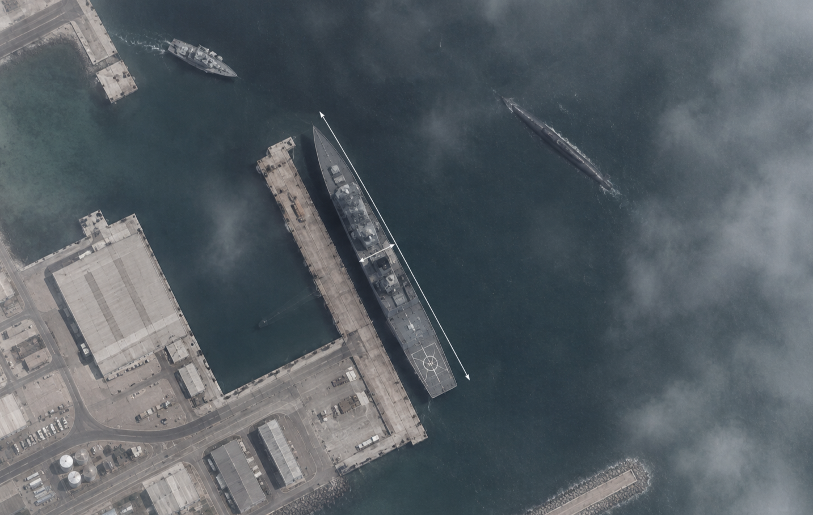

<div align="center">

# SATELLITE VESSEL INTELLIGENCE

## CASE 01 — UNKNOWN CONTACT → CRUDE OIL TANKER


### Intelligence Question

What vessel type is represented by the unidentified contact from the overhead EO imagery, and which observable characteristics support the classification? 


</div>

### Observed characteristics

- Long, broad hull
- Continuous central cargo deck
- Aft accommodation
- Visible deck piping
- No container stacks
- Central manifold deck cranes
- Tanker-like deck geometry

### Competing Hypotheses

| Hypothesis | Supporting Evidence | Contradicting Evidence |
|---|---|---|
| Crude oil tanker | Broad hull, continuous cargo deck, piping | Cargo itself cannot be visually confirmed |
| Product tanker | Similar hull/deck configuration | Dimensions/overall geometry less consistent |
| Bulk carrier | Commercial hull proportions | Lack of hatch arrangement |

---

### Assessment 

**The contact is assessed as an oil tanker with HIGH confidence. The combination of hull proportions, continuous cargo deck, tanker-specific piping and aft accommodation is inconsistent with container and bulk-carrier configurations. The available imagery supports a crude-oil-tanker hypothesis, although cargo carried at the time of imaging cannot be established from imagery alone.** 

---

### AIS Correlation & Identity Resolution

Once the contact is classified as a tanker, a temporally and spatially correlated AIS transmission is used to test the classification and identify the vessel.

| AIS / Vessel Data | Correlated Information |
|---|---|
| Vessel Name | **[AMANTEA]** |
| IMO / MMSI | **[9892810] / [241720000]** |
| AIS Type | **Tanker** |
| Length / Beam | **[329.98 m] / [60 m]** |
| Course | **[237 °]** |
| Timestamp | **[09/15/2026 / 7:35 UTC]** |

The AIS position and timestamp are consistent with the satellite acquisition, while the reported dimensions, vessel type and orientation are broadly consistent with the observed contact.

### Vessel Particulars Cross-Check

Independent vessel records identify **[AMANTEA] (IMO [9892810])** as a **crude oil tanker**, with documented dimensions of **[330 m × 60 m]**.

These particulars are compared against the vessel's estimated dimensions and physical configuration in the EO imagery.

### Identity Assessment

**Classification Confidence: HIGH**  
**Identity Confidence: [HIGH]**

The EO characteristics support an oil-tanker classification, while the correlated AIS transmission and independent vessel particulars provide additional evidence for resolving the contact to **[AMANTEA]**.

> **Analyst Note:** AIS correlation strengthens identification but is not treated as conclusive where timing, position, dimensions or physical characteristics present material inconsistencies.

### Final Assessment

**The contact is assessed as [AMANTEA], IMO [9892810] — a crude oil tanker.**

The assessment is supported by the convergence of **EO imagery, AIS data and independent vessel particulars**.

### Final assessment: **Crude oil tanker, HIGH confidence**

---

<div align="center">

## CASE 02 — UNKNOWN NAVAL CONTACT → SURFACE COMBATANT

### Intelligence Question

Can an unidentified naval contact be classified and attributed when AIS information is unavailable and the EO image is affected by atmospheric degradation?



</div>

---

### 01 · Detection

An unidentified maritime contact is detected alongside a generic naval facility in commercial EO imagery.

The contact is sufficiently resolved to examine its overall hull geometry and major structural features, but atmospheric haze limits some finer details.

### 02 · Object Determination

The contact is assessed as a **vessel**, rather than a fixed maritime structure or platform.

Its elongated hull, defined bow and stern, deck arrangement and position alongside the pier support the vessel determination.

### 03 · Observed Characteristics

- Long, narrow hull
- Grey naval-style coloration
- Forward gun position
- Large central superstructure
- Radar / sensor structures
- Aft flight deck
- No commercial cargo configuration
- Dimensions estimated from the EO image

### 04 · Competing Hypotheses

| Hypothesis | Supporting Evidence | Contradicting Evidence |
|---|---|---|
| Destroyer / surface combatant | Hull geometry, forward gun, large superstructure, aft flight deck | Fine structural details affected by atmospheric conditions |
| Frigate | Similar naval configuration | Apparent size and overall proportions less consistent |
| Patrol / support vessel | Naval context | Vessel dimensions and combatant-style configuration less consistent |

### 05 · Classification

The physical configuration is most consistent with a **large naval surface combatant**.

The assessment is based on the combination of hull proportions, forward gun position, central superstructure, sensor architecture and aft flight deck.

**Classification Confidence: MEDIUM–HIGH**

---

### 06 · Temporal & Geospatial Correlation

Unlike commercial vessels, the contact does not provide a usable public AIS identity for direct vessel correlation.

The investigation therefore shifts from AIS-based identity resolution to **temporal and geospatial correlation**.

| Correlation Factor | Evidence |
|---|---|
| Image acquisition | **[DATE / TIME UTC]** |
| General location | **Fictionalized coastal naval facility** |
| Berth / pier position | **[Berth / facility reference]** |
| Vessel dimensions | **[Estimated length × beam]** |
| Vessel orientation | **[Observed orientation]** |
| Weather / image quality | **Atmospheric haze / partial cloud interference** |

The contact is compared against publicly available vessel references and imagery from an appropriate time period.

---

### 07 · Identity Assessment

Where AIS is unavailable, identity cannot be established from a single transmission.

Instead, the candidate assessment considers the convergence of:

- EO-derived dimensions
- Vessel architecture
- Relative position within the facility
- Vessel orientation
- Acquisition timeframe
- Publicly available vessel imagery / references
- Consistency with known characteristics of the candidate class

No single characteristic is treated as conclusive.

---

### Confidence

**Classification Confidence: MEDIUM–HIGH**

**Identity Confidence: MEDIUM**

The imagery supports classification as a large naval surface combatant, while the absence of a directly correlated AIS identity and the degraded optical conditions limit the strength of individual-vessel attribution.

### Analyst Note

> Absence of AIS does not establish concealment or unusual behaviour. Some vessel categories, including warships, may not be required to carry AIS under international carriage requirements. :contentReference[oaicite:1]{index=1}

The assessment therefore relies on non-AIS evidence and should remain appropriately qualified.

---

### 08 · Image Quality & Limitations

Atmospheric haze and partial cloud interference reduce the visibility of fine vessel details.

This creates uncertainty around:

- Small superstructure features
- Sensor configuration
- Precise beam estimation
- Fine deck equipment

However, the overall hull geometry and major structural arrangement remain sufficiently observable for vessel classification.

> **Image quality affects the confidence of individual observations — not necessarily the entire classification.**

---

### Final Assessment

**The contact is assessed as a large naval surface combatant, with MEDIUM–HIGH classification confidence.**

The available EO imagery supports the classification through the vessel's overall dimensions, hull geometry, superstructure arrangement, forward gun position and aft flight deck.

Because no directly correlated AIS identity is available, individual-vessel attribution relies on temporal, geospatial and imagery-based correlation. Atmospheric degradation further limits the confidence of fine-grained identification.

**The evidence supports the classification more strongly than the individual-vessel identity.**

---

# SATELLITE VESSEL INTELLIGENCE

**Detect · Observe · Measure · Classify · Assess**

Transforming overhead imagery into structured vessel intelligence through visual analysis, spatial measurement and evidence-based classification.

---

## Intelligence Question

### What can observable vessel characteristics reveal from overhead imagery?

Overhead imagery can provide evidence of a vessel's presence, geometry, dimensions, deck configuration and structural characteristics.

The objective is not simply to identify an object as a vessel.

The objective is to determine **what can be reliably observed, what those observations may indicate, and what classification can be supported by the available evidence.**

---

## 01 — Observation

The analysis begins with the imagery itself.

The first question is:

> **What is directly visible?**

Observable characteristics may include:

- Overall vessel geometry
- Hull shape and proportions
- Bow and stern configuration
- Deck layout
- Cargo arrangement
- Superstructure and bridge position
- Cranes, piping or other visible infrastructure
- Relationship to surrounding maritime infrastructure

The detected object is first assessed as:

**Vessel · Barge · Platform · Buoy · Other · Unresolved**

> **Analytical principle:** A classification is not assigned before the observable object has first been identified.

---

## 02 — Identification

Once an object is assessed as a vessel, the analysis considers its observable physical and structural characteristics.

The objective is to establish the broad vessel category before moving toward a more specific classification.

### Broad Class

Examples may include:

- Cargo
- Tanker
- Passenger
- Pleasure
- Fishing
- Offshore
- Other

### Subclass

Where sufficient evidence is available, the assessment may be refined to a more specific vessel type.

Examples may include:

- General Cargo
- Bulk Carrier
- Container Vessel
- Crude Oil Tanker
- Product Tanker
- LPG / LNG Carrier
- Ferry
- Yacht

> **Classification is based on converging characteristics rather than a single visual feature.**

---

## 03 — Measurement

Vessel geometry provides additional evidence for classification.

The primary measurements assessed are:

| Measurement | Analytical Use |
|---|---|
| **Length Overall (LOA)** | Approximate vessel length from the forward-most to aft-most visible extent |
| **Beam** | Approximate maximum vessel breadth |
| **L/B Ratio** | Additional indication of overall vessel proportions |

Where imagery scale or Ground Sampling Distance is known:

```text
Physical Distance = Pixel Distance × Ground Sampling Distance

```

Measurement confidence may be affected by image resolution, vessel orientation, georeferencing accuracy, shadow, wake and partial occlusion.

> Dimensions support classification but do not independently determine vessel type.

---

## 04 — Classification

Classification combines vessel geometry with observable structural evidence.

The assessment may consider:

- Hull proportions
- Deck configuration
- Cargo structures
- Superstructure location
- Bridge positioning
- Cargo-handling infrastructure
- Deck cranes
- Visible piping
- Container geometry
- Specialized containment structures

These observations may then be assessed against vessel categories and subclasses.

```text
OBSERVABLE STRUCTURE
        +
VESSEL GEOMETRY
        +
DIMENSION ESTIMATES
        ↓
CLASSIFICATION HYPOTHESIS
```

The resulting assessment is expressed as an analytical conclusion rather than an assumed fact.

For example:

>**Observed deck configuration and vessel proportions are consistent with a tanker arrangement. The available imagery supports a crude oil tanker hypothesis.**

---

## 05 — Status Assessment

The vessel's apparent operational state is assessed from the available imagery.

**Status	Assessment**
- Sailing / Underway	Evidence suggests active movement or an underway state, identified by presence of a wake.
- Stationary	Vessel appears stationary at the time of observation
- Unknown	Available imagery does not support a reliable status assessment

A single image represents a specific moment in time.

Observed position should not automatically be interpreted as a complete behavioural pattern.

Where additional information is available, imagery observations may be correlated with AIS or other maritime data.

---

## 06 — Confidence

Confidence reflects the strength and quality of the evidence supporting the
assessment.

| Level | Intelligence Assessment |
|---|---|
| **HIGH** | Multiple independent visual indicators converge, image quality is sufficient, and limited ambiguity remains in the assessment. |
| **MEDIUM** | The classification is plausible and supported by some evidence, but one or more relevant characteristics remain obscured, ambiguous or unresolved. |
| **LOW** | Available evidence is limited, conflicting or insufficient to support a reliable classification. |

### Confidence Factors

>**Confidence** is determined through an assessment of factors including:

- Image resolution and overall quality
- Sensor or imagery type
- Vessel visibility
- Vessel orientation
- Observable structural detail
- Degree of occlusion
- Shadow and wake interference
- Measurement reliability
- Availability of corroborating information
- Consistency between independent indicators

>**Confidence reflects the strength of the available evidence — not the certainty of the analyst.**

---

## 07 — Intelligence Assessment

Each analysed object is recorded as a structured assessment:

```text
OBJECT TYPE
        ↓
VESSEL CLASS
        ↓
VESSEL SUBCLASS
        ↓
LENGTH + BEAM
        ↓
STATUS
        ↓
EVIDENCE
        ↓
CLASSIFICATION
        ↓
CONFIDENCE
```

The final assessment distinguishes between:

**Observed characteristics**
What is directly visible in the imagery.

**Inference**
What those characteristics may indicate.

**Classification**
The vessel type most consistent with the available evidence.

**Confidence**
The strength of the evidence supporting that assessment.

>**NOTE: A hypothesis is never presented as an observed fact.**

---

